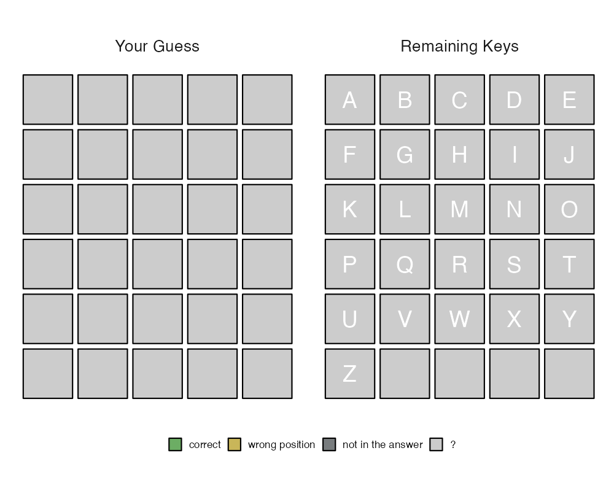
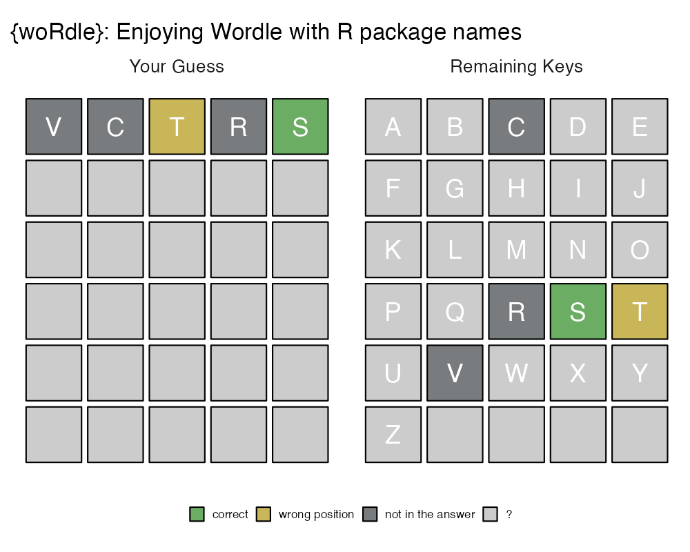
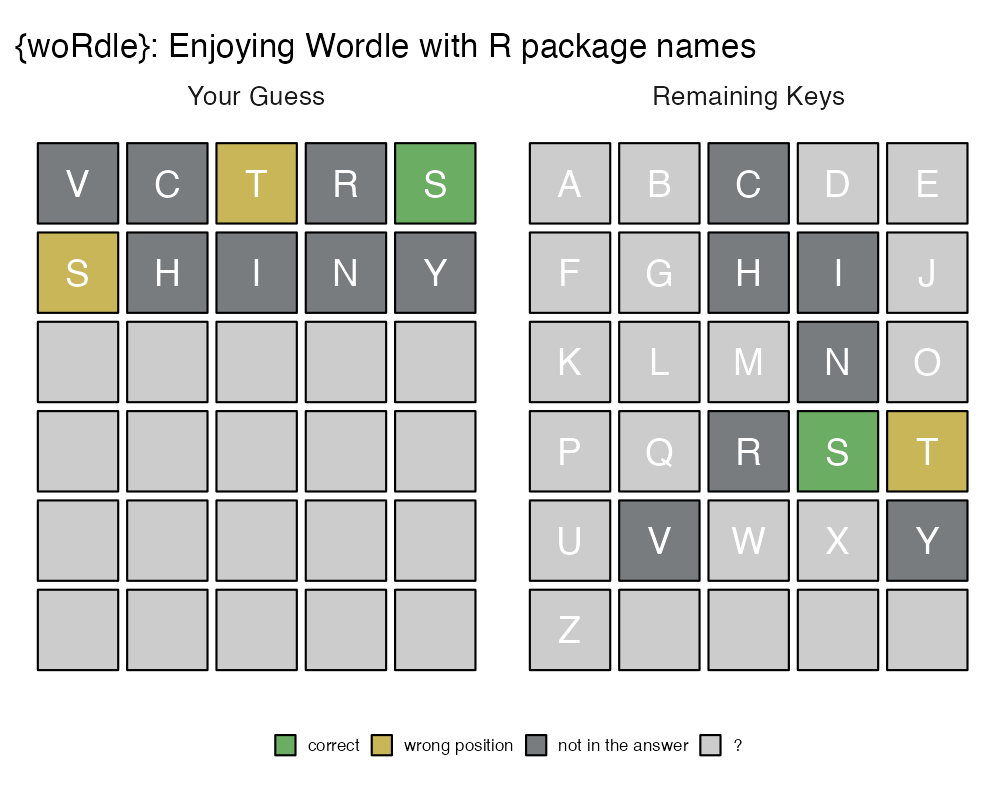
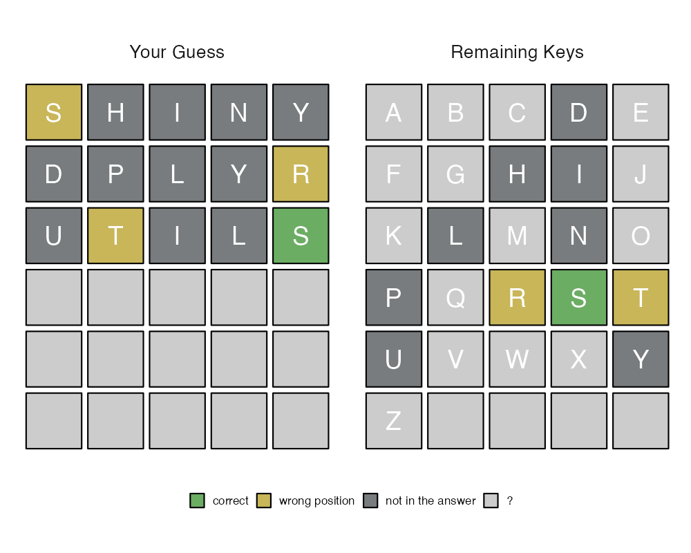
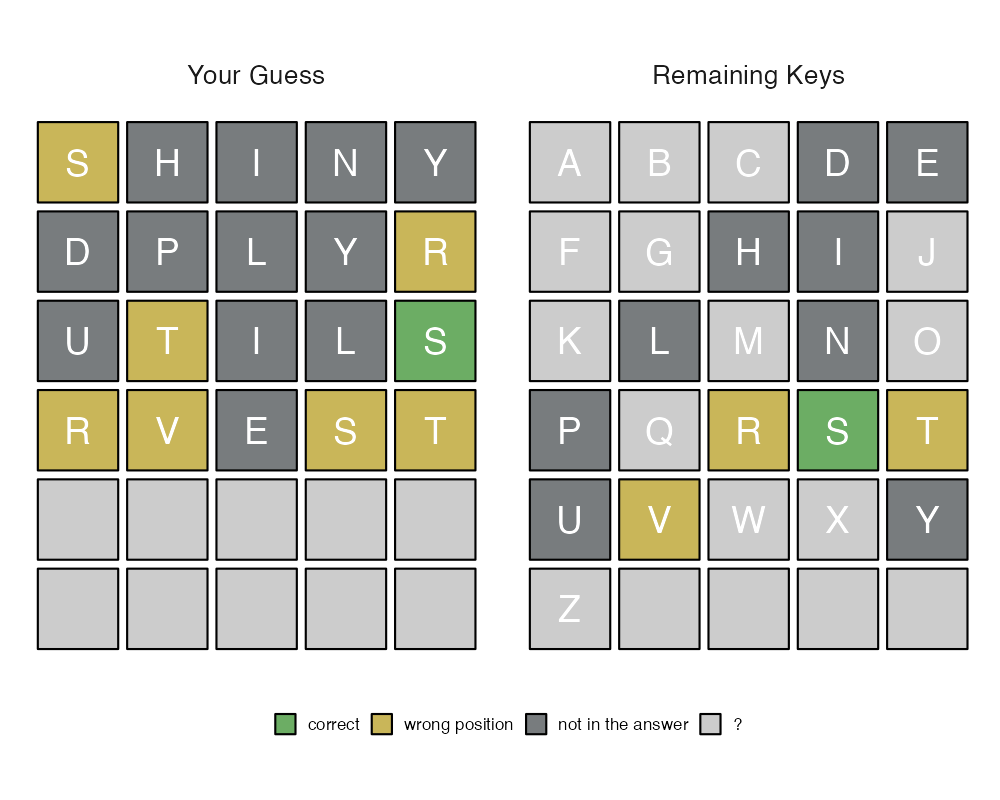
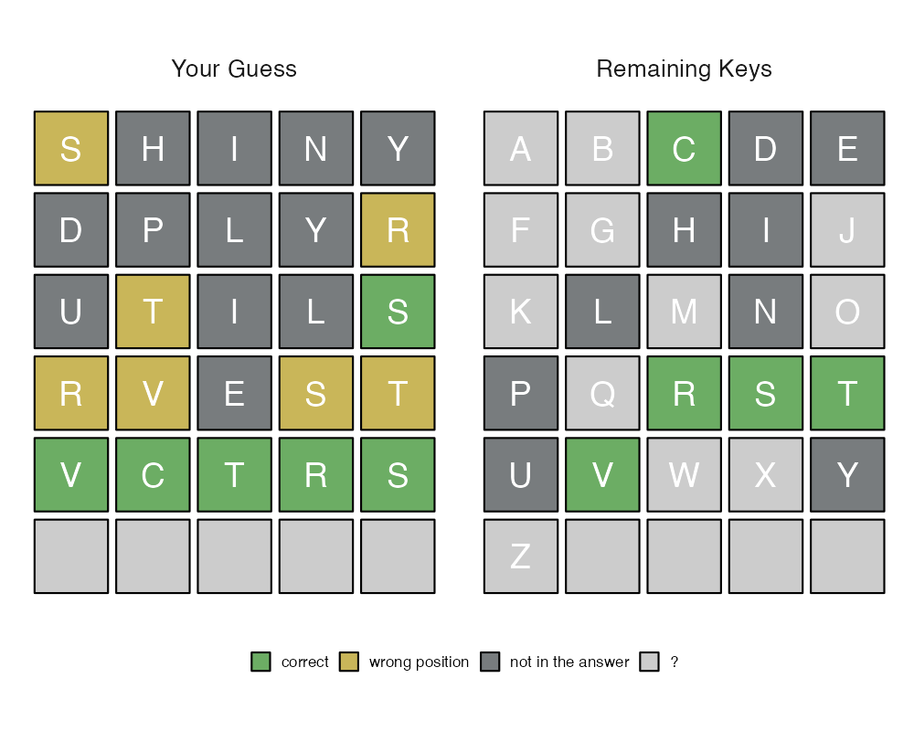
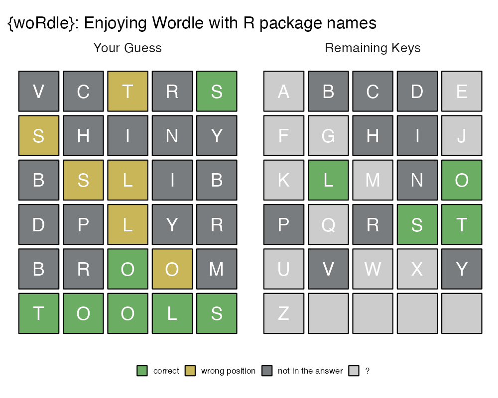

# woRdle

{woRdle}: Enjoying Wordle with R package names.

## Contact Info

* Jaehyun Song, Ph.D.
* Associate Professor in [Faculty of Informatics](https://www.kansai-u.ac.jp/Fc_inf/), [Kansai University](https://www.kansai-u.ac.jp/ja/?stt_lang=ja)
* E-mail: <song@kansai-u.ac.jp>
* Homepage: <https://www.jaysong.net>

## Installation

```r
# If you have {remotes},
remotes::install_github("JaehyunSong/woRdle")
# If you have {devtools},
devtools::install_github("JaehyunSong/woRdle")
# If you have {pacman},
pacman::p_install_gh("JaehyunSong/woRdle")
```

## Enjoy!

```r
> library(woRdle)
> woRdle::wordle()
```



```
## 55 package names retrieved.
> Input your guess (6 times reamined): vctrs
```



```
> Input your guess (5 times reamined): shiny
```



```
> Input your guess (4 times reamined): bslib
```



```
> Input your guess (3 times reamined): cjoint
## Guess must have 5 characters. (only alphabets)
```

```
> Input your guess (3 times reamined): dplyr
```



```
> Input your guess (2 times reamined): broom
```



```
> Input your guess (1 times reamined): tools
```



```
## Congratulation!!
## Your Record: 6 (Answer was {TOOLS})
##  Trial 1 : [-] [-] [Y] [-] [G] 
##  Trial 2 : [Y] [-] [-] [-] [-] 
##  Trial 3 : [-] [Y] [Y] [-] [-] 
##  Trial 4 : [-] [-] [Y] [-] [-] 
##  Trial 5 : [-] [-] [G] [Y] [-] 
##  Trial 6 : [G] [G] [G] [G] [G] 
```

## Arguments

A function `wordle()` has two arguments&mdash;`answer` and `strict`.

* `answer`: `"installed"` (default), `"cran"`, or any five character.
   * `"installed"`: A pacakge list is obtained from your PC.
   * `"cran"`: A package list is obtained from CRAN.
   * any five character: You can set any answer with five characters.
* `strict`: a logical value; `TRUE` or `FALSE` (default).
   * If `TRUE`, a guess not in package list is not applicable.
