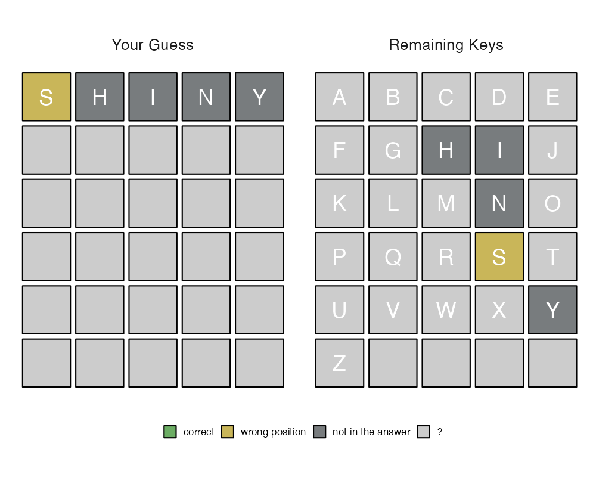
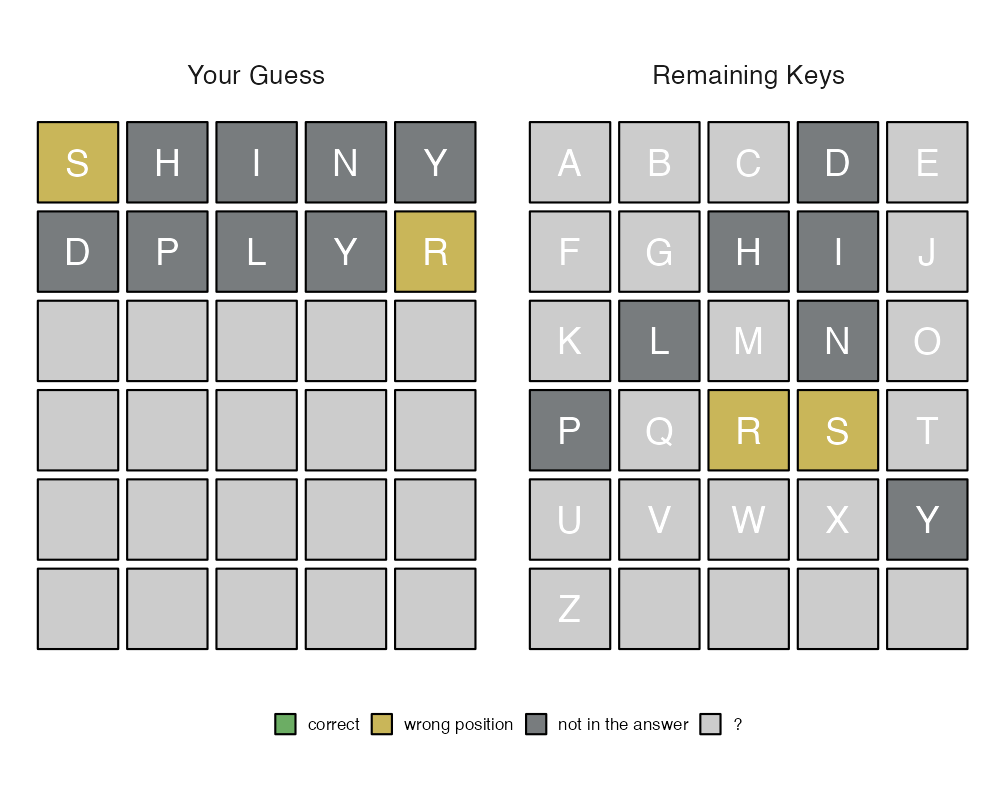

# woRdle

{woRdle}: Enjoying Wordle with R package names.

## Contact Info

* Jaehyun Song, Ph.D.
* Associate Professor in [Faculty of Informatics](https://www.kansai-u.ac.jp/Fc_inf/), [Kansai University](https://www.kansai-u.ac.jp/ja/?stt_lang=ja)
* E-mail: <song@kansai-u.ac.jp>
* Homepage: <https://www.jaysong.net>

## Installation

```r
# If you have {remotes},
remotes::install_github("JaehyunSong/woRdle")
# If you have {devtools},
devtools::install_github("JaehyunSong/woRdle")
# If you have {pacman},
pacman::p_install_gh("JaehyunSong/woRdle")
```

## Enjoy!

```r
> library(woRdle)
> wordle()
```


```
## 55 package names retrieved.
> Input your guess (6 times reamined): shiny
```



```
> Input your guess (5 times reamined): dplyr
```



```
> Input your guess (4 times reamined): utils
```


```
> Input your guess (3 times reamined): cjoint
## Guess must have 5 characters. (only alphabets)
```

```
> Input your guess (3 times reamined): rvest
```


```
> Input your guess (2 times reamined): vctrs
```


```
## Congratulation!!
## My Record: 5 (Answer was {VCTRS})
## 🟨⬛⬛⬛⬛
## ⬛⬛⬛⬛🟨
## ⬛🟨⬛⬛🟩
## 🟨🟨⬛🟨🟨
## 🟩🟩🟩🟩🟩
```

## Arguments

A function `wordle()` has two arguments&mdash;`answer` and `strict`.

* `answer`: `"installed"` (default), `"cran"`, `"ranking"`, or any five character.
   * `"installed"`: A pacakge list is obtained from your PC.
   * `"cran"`: A package list is obtained from CRAN.
   * `"ranking`: Top downloaded package list is obtained from CRAN using an R package, {[cranlogs](https://cran.r-project.org/web/packages/cranlogs/index.html)}.
   * You can set any answer with five characters, for example, `"knitr"` or `"seoul"`.
* `strict`: a logical value; `TRUE` (default) or `FALSE`.
   * If `TRUE`, a guess not in package list is not applicable. If `FALSE`, a guess can have any five charcters.
   * This arguments work only when `answer` is `"installed"`, `"cran"`, `"ranking"`.

## Useful functions

* `wordle_list()`: Display a list of package names with five alphabets.
   * `type = "installed"`: A pacakge list is obtained from your PC. (default)
   * `type = "cran"`: A package list is obtained from CRAN.